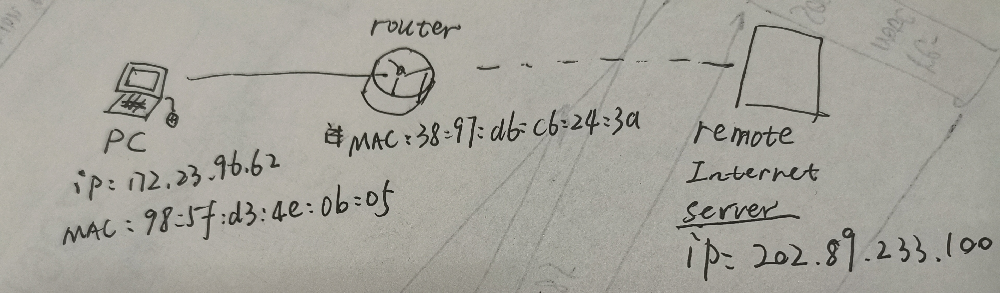

Ethernet 解书照 201611210137

> windows 64 bits BNU-Student 宿舍
>
> 数据：Ethernet.pacpng，Ethernet2.pacpng，trace-ethernet.pacpng

## Step 1: Manual GET with Telnet 

*Proceed as follows to capture a trace of ping packets; alternatively you may use a supplied trace.* 

1. *Pick a remote web server or other publicly reachable Internet host and use ping to send some ping messages and check that it sends replies.* 

   

2. *Launch Wireshark and start a capture of Ethernet frames with a filter of “icmp”, making sure that “enable MAC name resolution” is checked.* 

   

   

3. *When the capture is started, repeat the ping command above. This time, the packets will also be recorded by Wireshark.*

4. *After the ping command is complete, return to Wireshark and use the menus or buttons to stop the trace. You should now have a short trace similar to that shown in the figure below. If you do not succeed in capturing a trace then use the supplied one. Note that the trace we supply begins with ping messages, and then has other kinds of Ethernet frames*

   

## Step 2: Inspect the Trace 

观察结构

## Step 3: Ethernet Frame Structure

*To show your understanding of the Ethernet frame format, draw a figure of the ping message that shows the position and size in bytes of the Ethernet header fields.* 

**Wireshark抓到的以太网帧没有FCS校验字段**

## Step 4: Scope of Ethernet Addresses 

*Draw a figure that shows the relative positions of your computer, the router, and the remote server. Label your computer and the router with their Ethernet addresses. Label your computer and the remote server with their IP addresses. Show where the Ethernet and the rest of the Internet fit on the drawing.* 

## Step 5: Broadcast Frames 

**我抓了一会儿，只有路由器发出的ARP广播包（请见Ethernet2.pcapng），于是这里我参考了题设提供的trace-ethernet.pacpng，看到有多播包**

组播的MAC地址为：01:00:5e:00:00:01

*Answer the following questions:*

1. *What is the broadcast Ethernet address, written in standard form as Wireshark displays it?*

   FF:FF:FF:FF:FF:FF

2. *Which bit of the Ethernet address is used to determine whether it is unicast or multicast/broadcast?* 

   Ethernet地址的二进制表示中：头8位的最低位，1表示为multicast，0表示unicast；所有位都是1则表示为broadcast。

## 实验体会

加深了我对以太网协议的理解，了解了以太网帧的构造，丰富了我对计算机网络的认识，我学到了很多东西，增加了我对计网的兴趣。