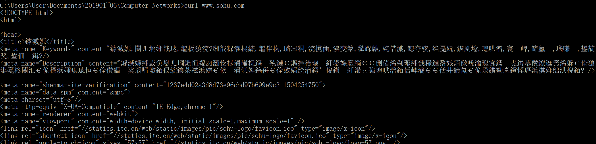
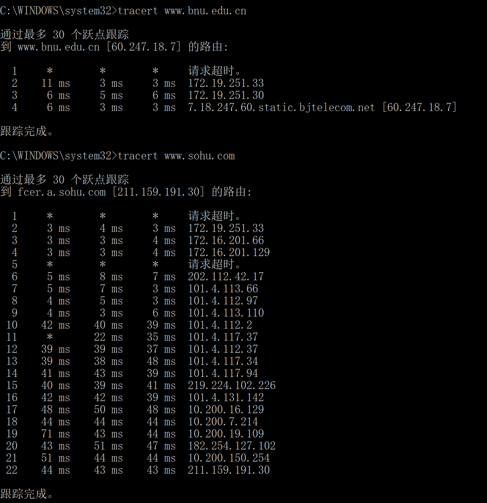
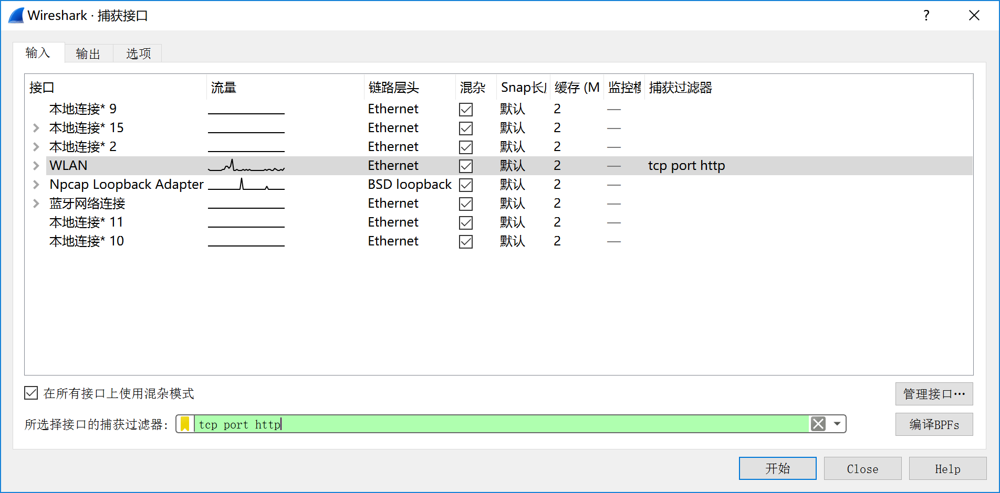
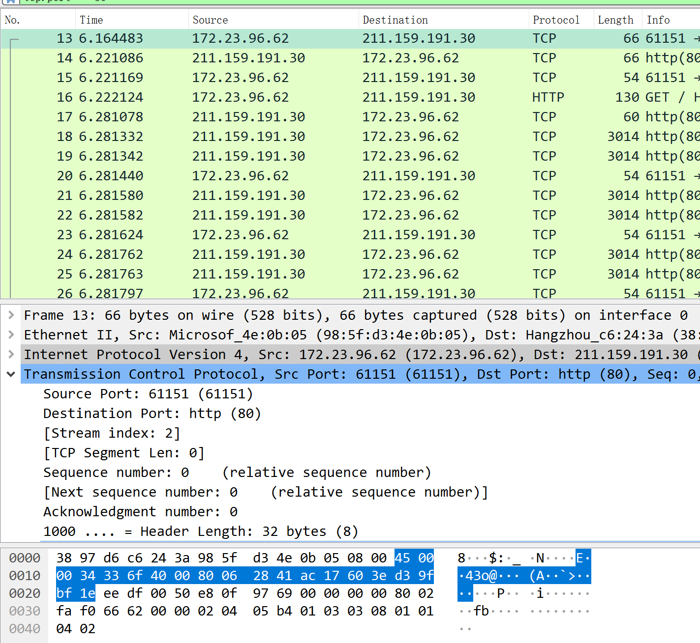
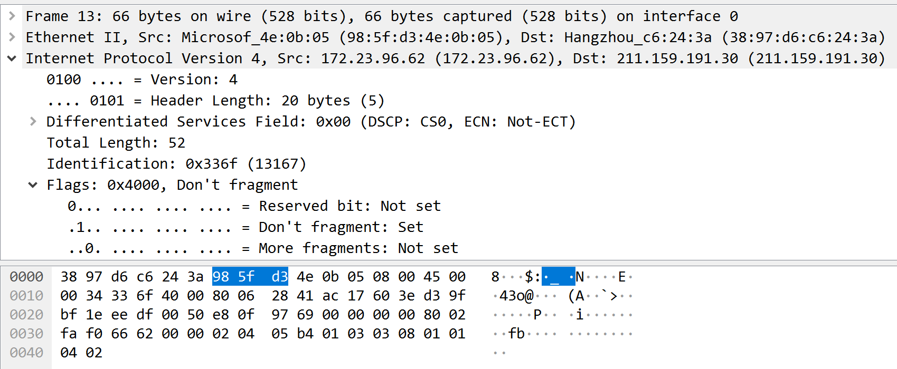
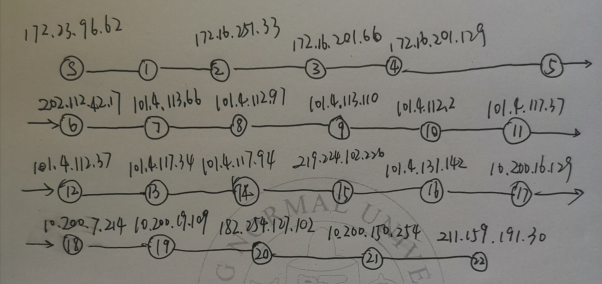
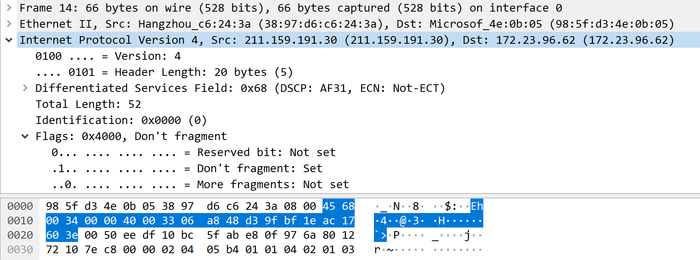

IPv4 解书照 201611210137

> windows 64 bits BNU-Student 宿舍
>
> 数据：Ipv4.pacpng

## Step 1: Capture a Trace 

*Proceed as follows to capture a trace assuming that your computer has IPv4 connectivity; alternatively, you may use a supplied trace. The trace we want to gather is a simple web fetch from a remote server, which will cause your computer to send and receive IP packets, followed by a traceroute to the remote server to find the path it uses over the Internet.* 

1. *Pick a URL at a remote server and check that you can fetch the contents with wget or curl, e.g.*

   

2. *Perform a traceroute to the same remote server to check that you can discover information about the network path.  On Windows, type, e.g., “tracert www.sohu.com”.*

   

3. *Launch Wireshark and start a capture with a filter of “tcp port 80“. Make sure to check “enable network name resolution”.*

   

4. *After the capture is started, repeat the wget/curl command above. This time, the packets will also be recorded by Wireshark.* 

5. *After the command is complete, return to Wireshark and stop the trace.* 

## Step 2: Inspect the Trace 

*Select any packet in the trace and expand the IP header fields (using the “+” expander or icon) to see the details.* 

## Step 3: IP Packet Structure 

*To show your understanding of IP, sketch a figure of an IP packet you studied. It should show the position and size in bytes of the IP header fields as you can observe using Wireshark. Since you cannot easily determine sub-byte sizes, group any IP fields that are packed into the same bytes.*

eg:

*By looking at the IP packets in your trace, answer these questions:* 

1. What are the IP addresses of your computer and the remote server? 

   my computer:  172.23.96.62

   remote server: 211.159.191.30

2. *Does the Total Length field include the IP header plus IP payload, or just the IP payload?* 

   IP header plus IP payload

3. *How does the value of the Identification field change or stay the same for different packets? For instance, does it hold the same value for all packets in a TCP connection or does it differ for each packet? Is it the same in both directions? Can you see any pattern if the value does change?* 

   由同一计算机发出的IP数据包的Identification每次加一，一次TCP连接中每个都不同。

4. *What is the initial value of the TTL field for packets sent from your computer? Is it the maximum possible value, or some lower value?*  

   128

   最大值是255，这里用的应该是推荐值128，也有的使用64。

5. *How can you tell from looking at a packet that it has not been fragmented? Most often IP packets in normal operation are not fragmented. But the receiver must have a way to be sure.* 

   IP数据包首部有一个标志位（Flags），按顺序是Reserved bit（没用，必为0）、Don‘t fragment（DF）、More fragments（MF），其中DF为1表示未分片，0则相反；MF=0表示这是最后一片，否则后面还有。

6. *What is the length of the IP Header and how is this encoded in the header length field? Hint: notice that only 4 bits are used for this field, as the version takes up the other 4 bits of the byte.*

   length of the IP header: 20B+可变部分的长度+填充部分的长度。当然这个例子里是20B，没有别的添加。

   首部长度的单位固定是4B，其实就是5*4B = 20B。

## Step 4: Internet Paths 

*Using the traceroute output, sketch a drawing of the network path. If you are using the supplied trace, note that we have provided the corresponding traceroute output as a separate file.  Show your computer (lefthand side) and the remote server (righthand side), both with IP addresses, as well as the routers along the path between them numbered by their distance on hops from the start of the path. You can find the IP address of your computer and the remote server on the packets in the trace that you captured. The output of traceroute will tell you the hop number for each router.* 

*To finish your drawing, label the routers along the path with the name of the real-world organization to which they belong. To do this, you will need to interpret the domain names of the routers given by traceroute. If you are unsure, label the routers with the domain name of what you take to be the organization. Ignore or leave blank any routers for which there is no domain name (or no IP address).* 

## Step 5: IP Header Checksum

*From the trace, pick a packet sent from the remote server to your computer and check that you have a non-zero value in the checksum field.*

以此为例：

1. *Divide the header into 10 two byte (16 bit) words. Each word will be 4 hexadecimal digits shown in the packet data panel in the bottom of the Wireshark window, e.g., 05 8c* 

2. *Add these 10 words using regular addition. You may add them with a hexadecimal calculator (Google to find one), or convert them to decimal, add them, and convert them back to hexadecimal. Do whatever is easiest.* 

3. *To compute the 1s complement sum from your addition so far, take any leading digits (beyond the 4 digits of the word size) and add them back to the remainder. For example: 5a432 will become a432 + 5 = a437.* 

4. *The end result should be 0xffff. This is actually zero in 1s complement form, or more precisely 0xffff is -0 (negative zero) while 0x0000 is +0 (positive zero).* 

   4568 + 0034 + 0000 + 4000 + 3306 + a848 + d39f + bf1e + ac17 + 603e = 3FFFC

   FFFC + 0003 = 0xffff，成了。

## 实验体会

加深了我对IPv4协议的理解，了解IPv4中checksum的计算，丰富了我对计算机网络的认识，我学到了很多东西，增加了我对计网的兴趣。