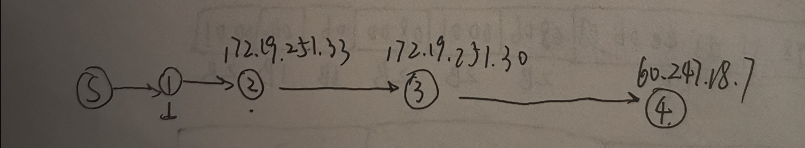

ICMP 解书照 201611210137

> windows 64 bits BNU-Student 宿舍
>
> 数据：icmp.pcapng

## Step 1: Capture a Trace 

*Proceed as follows to capture a trace of ICMP traffic that results from ping and traceroute; alternatively, you may use a supplied trace.*

1. *Pick a remote computer such as a server as a target, e.g., www.cs.vu.nl, and check that you can successfully ping it.* 

   www.sohu.com 和 www.bnu.edu.cn 都ping成了

   

2. *Check to see that you can traceroute to the same computer while invoking traceroute with options to send ICMP traffic rather than other traffic such as UDP.* 

   

3. *Launch Wireshark and start a capture with a filter of “icmp“. Make sure to check “enable network name resolution”. This will translate the IP addresses of the computers and routers sending packets into names, which will help you to recognize the organizations on the network path taken by your packets.*

   

4. *When the capture is started, repeat the ping command you tested, wait a few seconds, and then repeat the traceroute command as well. This time, the ICMP packets sent and received by these two programs will be recorded by Wireshark.* 

5. *After the commands are complete, return to Wireshark and use the menus or buttons to stop the trace.* 

## Step 2: Echo (ping) Packets 

*Start your exploration by selecting an echo (ping) request and reply packet at the start of the trace. Expand the ICMP block (by using the “+” expander or icon) to see the ICMP header and payload details:* 

*Answer the following questions to demonstrate your understanding of ICMP echo messages:* 

1. What are the Type/Code values for an ICMP echo request and echo reply packet, respectively? 

   #### echo request

   Type: 0x08

   Code: 0x00

   #### echo reply

   Type: 0x00

   Code:0x00

2. How do the Identifier and Sequence Number compare for an echo request and the corresponding echo reply? 

   相同

3. How do the Identifier and Sequence Number compare for successive echo request packets? 

   Identifier不变，Sequence Number每次+1

4. Is the data in the echo reply the same as in the echo request or different? 

   还真是一样的，都是abcdefghijklmnopqrstuvwabcdefghi

## Step 3: TTL Exceeded (traceroute) Packets 

*Next, explore traceroute traffic by selecting any Time Exceeded ICMP packet in your trace. Expand the ICMP block (by using the “+” expander or icon) to see the ICMP header and payload details:* 

*Draw a picture of one ICMP TTL Exceeded packet to make sure that you understand its nested structure. On your figure, **show the position and size in bytes of the IP header**, **ICMP header with details of the Type/Code and checksum subfields, and the ICMP payload.**  Within the ICMP payload, draw another rectangle that shows the overall structure of the contents of the payload.* 

*Answer the following questions:* 

1. *What is the Type/Code value for an ICMP TTL Exceeded packet?* 

   Type: 0x11

   Code: 0x00

2. *Say how the receiver can safely find and process all the ICMP fields if it does not know ahead of time what kind of ICMP message to expect.* The potential issue, as you have probably noticed, is that different ICMP messages can have different formats. For instance, Echo has Sequence and Identifier fields while TTL Exceeded does not.

   不同的Type对应不同的格式，只要根据相应Type对应的报文格式进行解析

3. *How long is the ICMP header of a TTL Exceeded packet?*

   Type1B、Code1B、CheckSum2B、Unused4B，一共8B。

4. *The ICMP payload contains an IP header. What is the TTL value in this header? Explain why it has this value. Guess what it will be before you look!* 

   TTL = 1，当路由器收到TTL值为1的IP数据包时，会向源主机发送ICMP超时报文，将收到的数据包的IP首部和IP数据部分的前8个字节作为ICMP超时报文的数据部分，并且丢弃收到的数据包。

## Step 4: Internet Paths 

*Look at the traceroute portion of the trace, which will have a series of ICMP echo request packets followed by ICMP TTL Exceeded packets. The echo requests are sent from the source (your computer) to the destination whose path is being probed. The TTL Exceeded packets are coming from routers along the path back to your computer, triggered by the TTL field counting down to zero.* 

*By looking at the details of the packets, answer the following questions:* 

1. *How does your computer (the source) learn the IP address of a router along the path from a TTL exceeded packet? Say where on this packet the IP address is found.*

   ICMP是在IP协议之上的报文，是路由器发送给源节点的报文，可以从ICMP的下一层即IP报文中获取相应路由器的IP地址。

2. *How many times is each router along the path probed by traceroute?*

   3次

3. *How does your computer (the source) craft an echo request packet to find (by eliciting a TTL Exceeded response) the router N hops along the path towards the destination? Describe the key attributes of the echo request packet.*

   对于封装echo request ICMP数据包的IP数据包，将其TTL设置为N，source IP设置为本机IP地址，destination IP设置为目的IP地址，其实需要修改的只有TTL和相应序号。

*Using the traceroute output, sketch a drawing of the network path. Show your computer (lefthand side) and the remote server (righthand side), both with IP addresses, as well as the routers along the path between them numbered by their distance on hops from the start of the path. You can find the IP address of your computer and the remote server on the echo packets in the trace that you captured. The output of traceroute will tell you the hop number for each router.*  

*To finish your drawing, label the routers along the path with the name of the real-world organization to which they belong. To do this, you will need to interpret the domain names of the routers given by traceroute. If you are unsure, label the routers with the domain name of what you take to be the organization. Ignore or leave blank any routers for which there is no domain name (or no IP address).* 

tracert了www.sohu.com，以此为例：

## 实验体会

加深了我对ICMP协议的理解，了解了ICMP超时报文、ICMP回显应答报文和请求回显报文的应用和性质，丰富了我对计算机网络的认识，我学到了很多东西，增加了我对计网的兴趣。