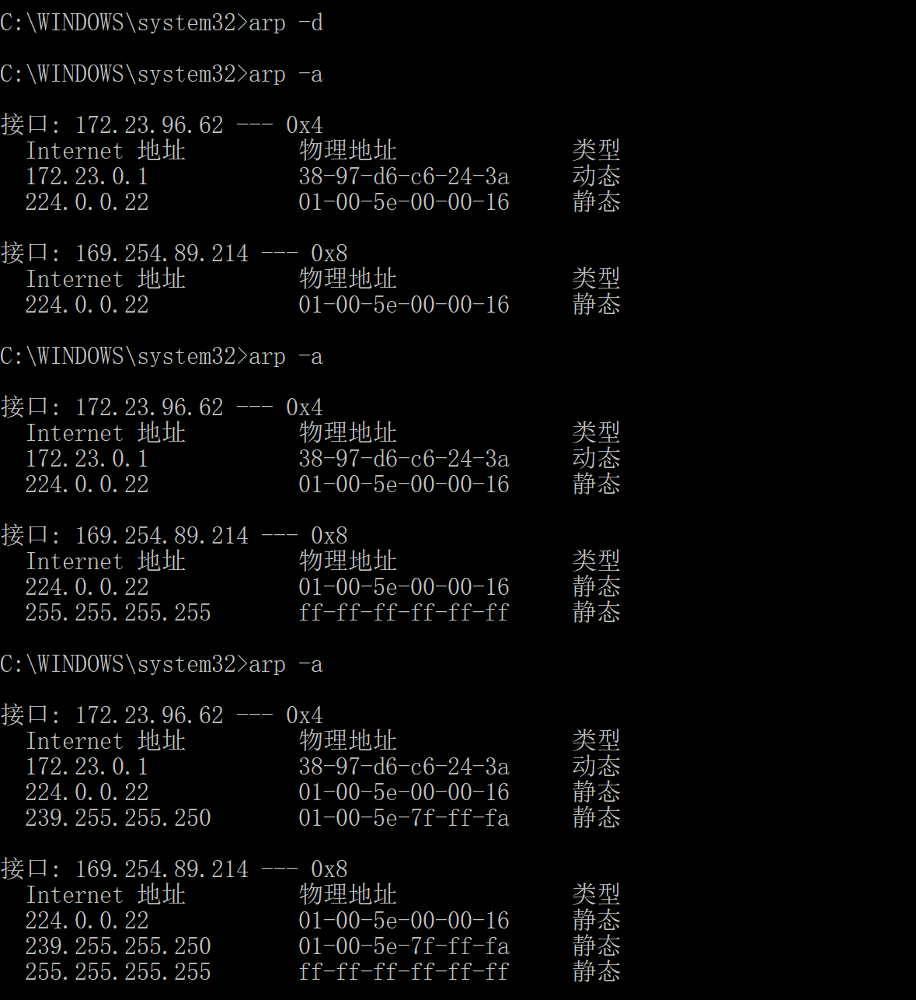

ARP
 解书照 201611210137

> windows 64 bits BNU-Student 宿舍
>
> 数据 arp.pcapng

## Step 1: Capture a Trace 

1. *Find the Ethernet address of the main network interface of your computer with the `ifconfig / ipconfig` command.* 

   **MAC address: 98-5F-D3-4E-0B-05**

   

   

2. *Find the IP address of the local router or default gateway that your computer uses to reach the rest of the Internet using the `netstat / route` command.*

   **Destination: 0.0.0.0  Gateway:172.23.0.1**

   

3. *Launch Wireshark and start a capture with a filter of “arp”.*

   

4. *When the capture is started, use the “arp” command to clear the default gateway from the ARP cache.*

   **以管理员身份执行`arp -d`和`arp -a`**

5. *Now that you have cleared your ARP cache, fetch a remote page with your Web browser.* 

6. *Once you have captured some ARP traffic, stop the capture. You will need the trace, plus the Ethernet address of your computer and the IP address of the default gateway for the next steps.* 

   

## Step 2: Inspect the Trace 

*Set a display filter for packets with the Ethernet address of your computer. Find and select an ARP request for the default gateway and examine its fields.* 

*Next, select an ARP reply and examine its fields.* 

## Step 3: ARP request and reply 

*To show your understanding of an ARP exchange, draw a figure that shows the ARP request and reply packets sent between your computer and the default gateway. Make it for the case we examined of your computer doing an ARP for the default gateway. Label one packet the request and the other the reply. Give the sender and target MAC and IP addresses for each packet; you can use Wireshark to inspect the packets to get these values. Finally, circle the sought after Ethernet address on your drawing to show where it comes from in the exchange.* 

### ARP request packet

#### Ethernet

Destination:  FF FF FF FF FF FF ，这里ARP请求是广播发出的。

Source:  98 5f d3 4e 0b 05

#### ARP

Sender MAC Address: 98 5f d3 4e 0b 05

Target MAC Address: 00 00 00 00 00 00

### ARP reply packet

#### Ethernet

Destination:  98 5f d3 4e 0b 05，单播

Source: 38 97 d6 c6 24 3a

#### ARP

Sender MAC Address: 38 97 d6 c6 24 3a

Target MAC Address: 98 5f d3 4e 0b 05

## Step 4: Details of ARP over Ethernet 

*To look at further details of ARP, examine an ARP request and ARP reply to answer these questions:* 

1. What opcode is used to indicate a request? What about a reply? 

   request：00 01

   reply：00 02

2. How large is the ARP header for a request? What about for a reply?

   大小相同，分别为：硬件类型2B、协议类型2B、硬件地址长度1B、协议地址长度1B、opcode2B、发送端MAC地址6B、发送端IP地址4B、目的MAC地址6B、目的IP地址4B，一共28B。

3. What value is carried on a request for the unknown target MAC address?

   0x00 00 00 00 00 00

4. What Ethernet Type value which indicates that ARP is the higher layer protocol?

   0806代表是后面的数据包是ARP，0800代表后面的数据包是IP，8035代表是RARP。

5. Is the ARP reply broadcast (like the ARP request) or not?

   ARP reply是单播，可以看到本次实验的ARP reply给出了以太网目的地址98 5f d3 4e 0b 05。

## 实验体会

加深了我对ARP协议的理解，丰富了我对计算机网络的认识，我学到了很多东西，增加了我对计网的兴趣。

