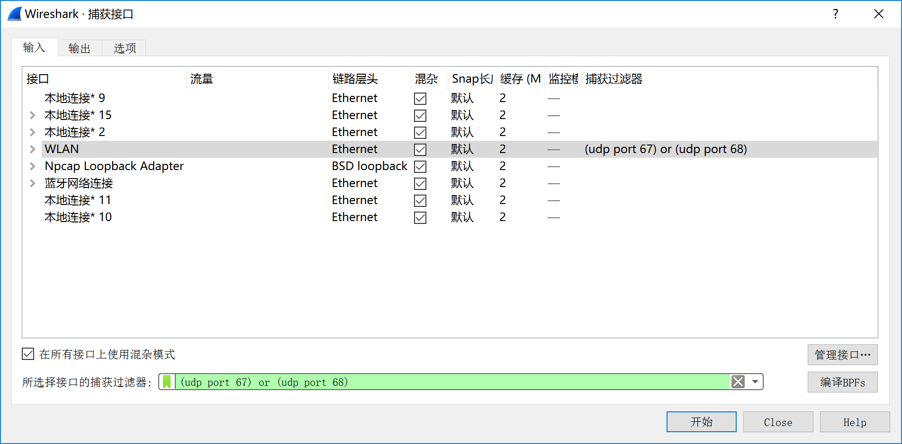
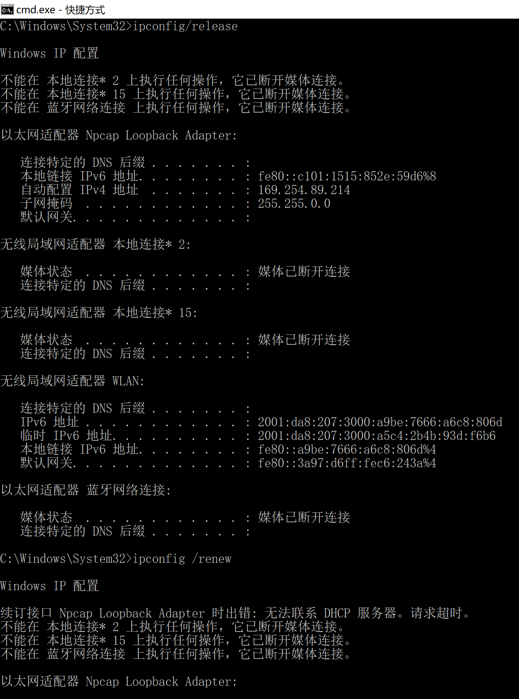
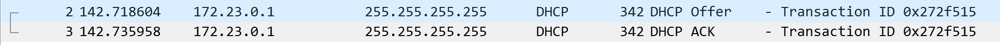
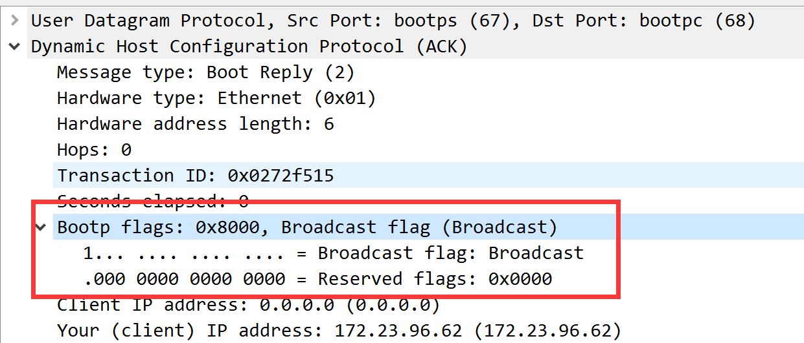
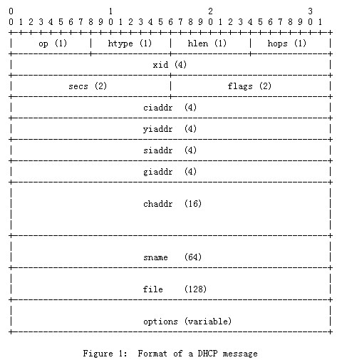

DHCP 解书照 201611210137

> windows 64 bits BNU-Student 宿舍
>
> 数据：dhcp.pcapng，trace-dhcp.pcapng

## Step 1: Capture a Trace

1. *Launch Wireshark and start a capture with a filter of “(udp port 67) or (udp port 68)”.* 

   

2. *When the capture is started, release and renew your IP address with the command given below. This procedure may cause your computer to lose network connectivity temporarily, and depending on the operating system it may disrupt network connections. To minimize the disruption, close any programs that are using remote servers and enter the commands into a local window.*

   *Windows: Type the command “ipconfig /release” followed by “ipconfig /renew”.*

   

3. *Once you have captured some DHCP traffic, stop the capture.* 

## Step 2: Inspect the Trace 

*Look for the short DHCP exchange (of a DHCP Request packet followed by a DHCP Ack packet) in your trace. Select the DHCP Request packet, and observe the protocol stack to see how DHCP messages are carried.* 

*Expand the BOOTP (DHCP) section (using the “+” expander or icon) to look at the details of a DHCP Request message. Now select a DHCP Ack packet and compare the BOOTP fields.* 

## Step 3: Details of DHCP Messages 

*To show your understanding of DHCP, draw a figure that shows a DHCP message. Show the position of the Ethernet, IP, UDP, and BOOTP protocol blocks, but divide the BOOTP protocol block into BOOTP fields (the initial part) and DHCP options (the last part).*

| 链路层头（Ethernet） | IP头    | UDP头 | DHCP报文 |
| -------------------- | ------- | ----- | -------- |
| 14B                  | 20B左右 | 8B    |          |

DHCP报文结构，我寻思我已经查了，干脆把我查到的贴上来吧

*Answer the following questions based on your examination of the BOOTP/DHCP fields for both the DHCP Request and DHCP Ack:* 

因为我抓到的包没有DHCP Request报文，所以我参考了题目给的样例包trace-dhcp.pcapng

1. *What are the two values of the BOOTP Message Type field?*

   从0到15共16 bits
   最左1Bit为1时表示 server将以广播方式传送封包给client
   最左1Bit为0时表示 server将以单播方式传送封包给client

2. *How long is the Transaction ID field? Say whether it is likely that concurrent DHCP operations done by different computers will happen to pick the same Transaction ID.*

   4B，问题2我不知道嗷

3. *What is the name of the field that carries the IP address that is being assigned to the client? You will find this field filled in on the DHCP Ack, as that message is completing the assignment.* 

4. *What is the value of the Magic Cookie that stands for DHCP?*

   0x63 82 53 63

5. *The first DHCP option is DHCP Message Type. What option value stands for this type?*

   53

6. *DHCP Requests will typically have a Client Identifier option. Look at the value of this option. How does it identify the client? Take a guess.*

   例子里是先说明了硬件类型，在给出了硬件地址来确定一个client

7. *DHCP Acks will typically have a Server Identifier option. Look at the value of this option. How does it identify the server? Take a guess.* 

   例子里是给出了Server的IPv4地址作为Identification

8. *What option value stands for the Requested IP Address option? And for the IP Address Lease Time option?*

   50 51

9. *How does the recipient of a DHCP message know that it has reached the last option?* 

   有个Option名为End, option value = 255

## Step 4: DHCP Message Addressing

Now we will look at how DHCP messages are addressed to computers at the UDP, IP and Ethernet layers. This is interesting because DHCP is used to assign IP addresses – a computer requesting a DHCP address may neither have its own IP address nor know the IP address of the DHCP server! 

*Start by selecting a DHCP Request packet and looking at its UDP details in the middle Wireshark panel.*  We will only look at the DHCP Request message to keep things simple, as the details of addressing differ for other DHCP messages.

1. *What port number does the DHCP client use, and what port number does the DHCP server use? Ports matter because UDP messages are addressed using ports. Both of these port numbers are on the Request in the source and destination port fields (and you will also see them on the Ack).* 

   从上一层的UDP数据报中可以看出 DHCP client port = 68, server port = 67.

Now look at the IP addresses in the IP protocol header of the packet for the next question. Do not look inside the BOOTP fields for the DHCP parameters, as we care about how DHCP messages are addressed at lower protocol layers. When the request is sent, your computer has no IP address and may not even know the IP address of the DHCP server, so the IP addressing differs from a routine IP packet.

2. *What source IP address is put on the Request message?*

   0.0.0.0

3. *What destination IP address is put on the Request message?*

   255.255.255.255

Finally, look at the Ethernet addresses for the next question.

4. *What source Ethernet address is put on the Request message, and what destination Ethernet address is put on the Request message? One of these addresses is a reserved address.* 

   source Ethernet address是本机网卡MAC地址

   destination Etherent address是ff:ff:ff:ff:ff:ff

Looking at the addressing should help you to understand why your computer may record the DHCP traffic of other local computers in your trace. Since the IP addressing is not yet established, many DHCP messages are sent to all computers on the local network. This makes sure every computer receives DHCP messages intended for them, but it poses a difficulty: one computer may receive DHCP messages intended for another computer.

5. *How does a computer work out whether a DHCP message it receives is intended as a reply to its DHCP Request message, and not a reply to another computer? Hint: if you are not sure then go over the fields you inspected previously in Step 2 above.* 

   计算机会对一下Transaction ID这个暗号,如果是一样的就说明是给自己的.

## 实验体会

加深了我对DHCP协议的理解，了解了DHCP分配IP地址的原理，丰富了我对计算机网络的认识，我学到了很多东西，增加了我对计网的兴趣。