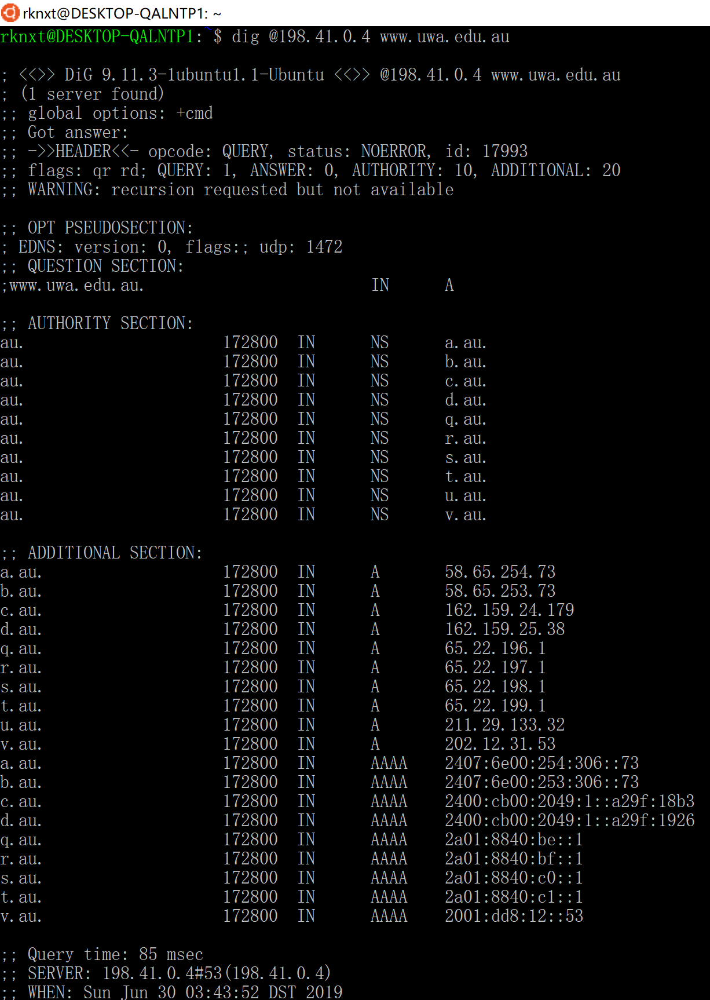

DNS 解书照 201611210137

> windows 64 bits BNU-Student 宿舍
>
> 数据：dns.pcapng,trace-dns.pacpng

## Step 1: Manual Name Resolution

*Pick a domain name to resolve, such as that of your web server. We will use www.uwa.edu.au. Find the IP address of one of the root nameservers by searching the web.* 

[根域名服务器IPv4地址]([https://baike.baidu.com/item/%E6%A0%B9%E5%9F%9F%E5%90%8D%E6%9C%8D%E5%8A%A1%E5%99%A8/5907519?fr=aladdin#1](https://baike.baidu.com/item/根域名服务器/5907519?fr=aladdin#1))

*Use dig to issue a request to a root nameserver to perform the first step of the resolution.* 

这里我用A的IPv4地址。因为windows上没有dig命令，所以我用了Windows的Ubuntu子系统。

这里我用的网址和题目给的一样。

*Continue the resolution process with dig until you complete the resolution. When you have alternatives to choose, prefer IPv4 nameservers and select the first one in alphabetical order. If this nameserver has multiple IP addresses then select the numerically smallest IP address.*

*Draw a figure that shows the sequence of remote nameservers that you contacted and the domain for which they are responsible. Note that future name resolutions are likely to be a much shorter sequence because they can use cached information.* For example, if you looked up a domain name in “.edu” then when you look up a different domain name in “.edu” you already know the name of the “.edu” nameserver. Thus you can start there, or even closer to the final nameserver depending on what you have cached; you do not need to start again at the root nameserver. 

`au->edu.au->uwa.edu.au->www.uwa.edu.au`

## Step 2: Capture a Trace

*Capture a trace of your browser making DNS requests as follows; alternatively, you may use a supplied trace. Now that we are familiar with the process of name resolution, we will inspect the details of DNS traffic. To generate DNS traffic you will both repeat the dig commands, and browse web sites.* 

1. *Close all unnecessary browser tabs and windows. Browsing web sites will generate DNS traffic as your browser resolves domain names to connect to remote servers. We want to minimize browser activity initially so that we capture only the intended DNS traffic.*

2. *Launch Wireshark and start a capture with a filter of “udp port 53”.* 

   

3. 跑dig，抓包。

## Step 3: Inspect the Trace 

## Step 4: Details of DNS Messages 

*Select the first DNS query that corresponds to your dig commands and expand its DNS block. Likely this query is the first packet in your trace, with the first several packets corresponding to your dig commands, followed by other DNS traffic produced by your browser. To check, see if there are several queries that list the domain you chose in the Info column, each followed by a response. We will use these DNS messages to study the details of the DNS protocol. Sometimes there may be other DNS traffic interspersed with these queries due to background activity; you should ignore these extraneous packets.   
Look at the DNS header, and answer the following questions:*

1. *How many bits long is the Transaction ID? Based on this length, take your best guess as to how likely it is that concurrent transactions will use the same transaction ID.*

   16位，$$p = 1/{2^{32}}$$

2. *Which flag bit and what values signifies whether the DNS message is a query or response?*

   第一个bit，0表示query，1表示response

3. *How many bytes long is the entire DNS header?*

   12

*Now examine the responses to the dig DNS queries you made. The initial response should have provided another nameserver one step closer to the nameserver, but not the final answer. You should find that it includes the original query in its Query section. It will also include records with both the name of the nameservers to contact next, and the IP addresses of those nameservers. The final response in this series will include the IP address of the domain name – this is the answer to the query.* 
*Look at the body of the DNS response messages, and answer the following questions:*

**这里我使用了trace-dns.pcapng**

4. *For the initial response, in what section are the names of the nameservers carried? What is the Type of the records that carry nameserver names?*

   au, NS

5. *Similarly, in what section are the IP addresses of the nameservers carried, and what is the Type of the records that carry the IP addresses?*

   Additional records，A

6. *For the final response, in what section is the IP address of the domain name carried?* 
   Answers section，DNS数据报中的[33, 48]bytes 

## Step 5: DNS Response Time 

IO Graph：

## 实验体会

加深了我对DNS协议的理解，了解了域名解析的过程，丰富了我对计算机网络的认识，我学到了很多东西，增加了我对计网的兴趣。