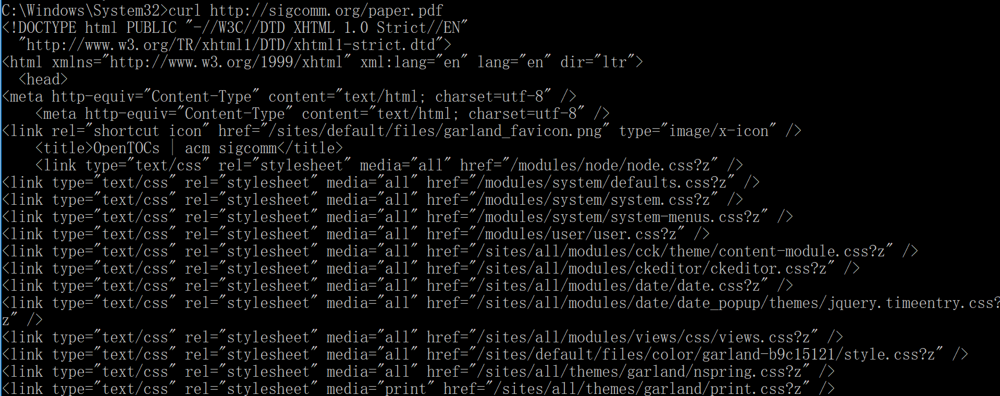
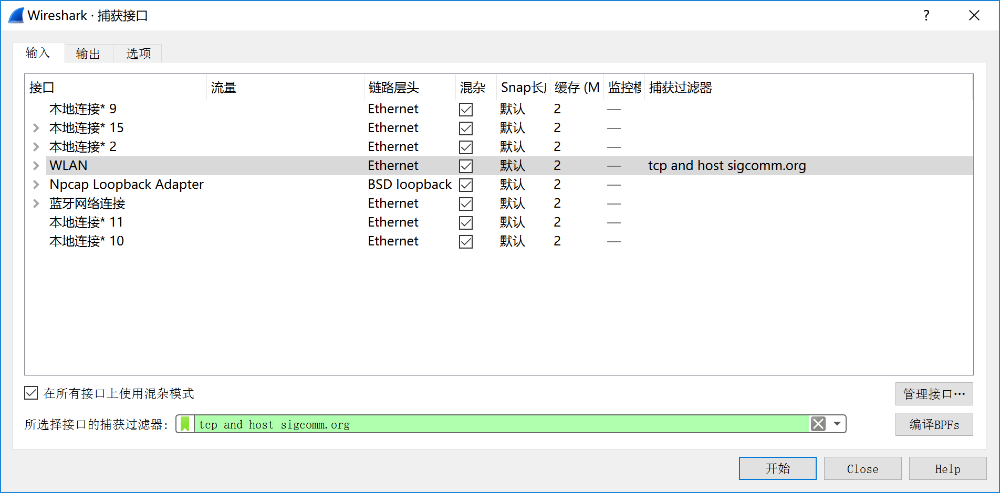
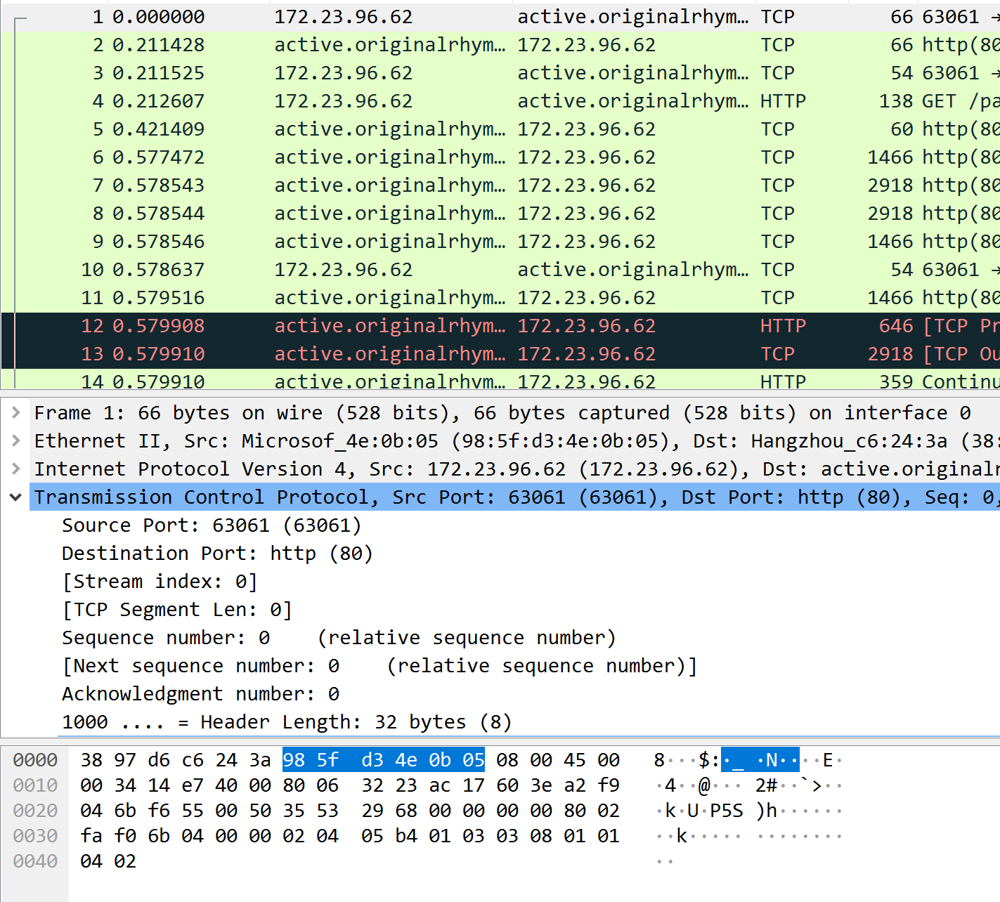
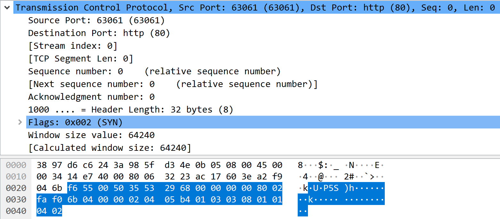
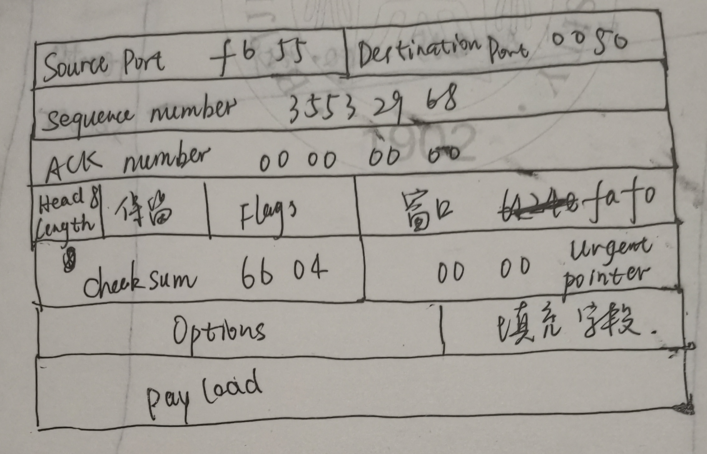
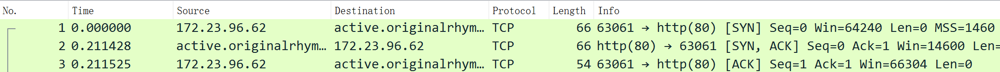
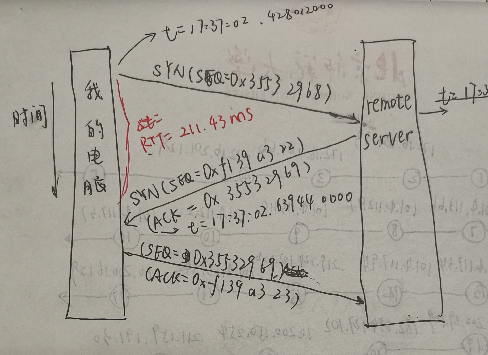
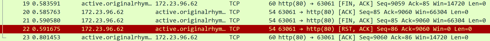
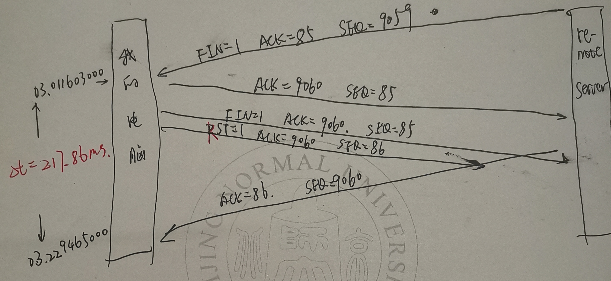
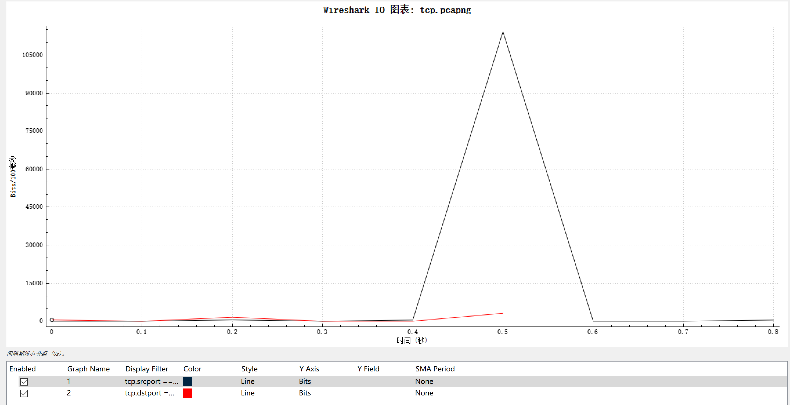

TCP 解书照 201611210137

> windows 64 bits BNU-Student 宿舍
>
> 数据是tcp.pacpng

## Step 1: Capture a Trace 

1. *Fetch the URL with wget or curl to check that you are able to retrieve at least 500 KB of content over at least several of network time seconds.*

   curl http://sigcomm.org/paper.pdf

   

2. *Launch Wireshark and start a capture with a filter of “tcp and host xx.xx.xx”, where xx.xx.xx is the name of the remote server from which you will fetch content, e.g., “conferences.sigcomm.org” in the figure showing our example below. The idea of the filter is to only capture TCP traffic between your computer and the server.* 

   

3. *After the capture is started, repeat the wget/curl command above. This time, the packets will also be recorded by Wireshark.*

4. *When the command is complete, return to Wireshark and use the menus or buttons to stop the trace. You should now have a trace similar to that shown in the figure below.  We have expanded the detail of the TCP header in our view, since it is our focus for this lab.* 

   

## Step 2: Inspect the Trace 

*Select a long packet anywhere in the middle of your trace whose protocol is listed as TCP. Expand the TCP protocol section in the middle panel (by using the “+” expander or icon).* 

## Step 3: TCP Segment Structure 

*To show your understanding of TCP, sketch a figure of the TCP segment you studied. It should show the position and size in bytes of the TCP header fields you can observe using Wireshark. Do not break down the Flags field, or any Options field, and if you find that some TCP fields share a byte then group them. As usual, your figure can simply show the frame as a long, thin rectangle.* 

以下图片是例子

figure of the TCP segment

## Step 4: TCP Connection Setup/Teardown 

### Three-Way Handshake 

*Draw a time sequence diagram of the three-way handshake in your trace, up to and including the first data packet (the HTTP GET request) sent by your computer when the connection is established Put your computer on the left side and the remote server on the right side. As usual, time runs down the page, and lines across the page indicate segments. The result will be similar to diagrams such as Fig. 6-37.*  

*Include the following features on your diagram:* 

* *The Sequence and ACK number, if present, on each segment. The ACK number is only carried if the segment has the ACK flag set.* 
* *The time in milliseconds, starting at zero, each segment was sent or received at your computer.*
* *The round-trip time to the server estimated as the difference between the SYN and SYN-ACK segments.* 

### Connection Options 

*As well as setting up a connection, the TCP SYN packets negotiate parameters between the two ends using Options. Each end describes its capabilities, if any, to the other end by including the appropriate Options on its SYN. Often both ends must support the behavior for it to be used during data transfer.* 
*Answer the following question:* 

1. *What TCP Options are carried on the SYN packets for your trace?* 
   * Maximum segment Size
   * Window scale
   * SACK permitted
   * No-Operation

### FIN/RST Teardown

Finally, the TCP connection is taken down after the download is complete.  This is typically done with FIN (Finalize) segments. Each side sends a FIN to the other and acknowledges the FIN they receive; it is similar to the three-way handshake. Alternatively, the connection may be torn down abruptly when one end sends a RST (Reset). This packet does not need to be acknowledged by the other side. 

*Draw a picture of the teardown in your trace, starting from when the first FIN or RST is issued until the connection is complete. As before, show the sequence and ACK numbers on each segment. If you have FINs then use the time difference to estimate the round-trip time.*

## Step 5: TCP Data Transfer  

*Under the Statistics menu select an “IO Graph”.  By default, this graph shows the rate of packets over time. Tweak it to show the download rate with the changes given below.* 

Answer the following questions to show your understanding of the data transfer:

1. *What is the rough data rate in the download direction in packets/second and bits/second once the TCP connection is running well?*

   $$1150000bits/s$$

   $$100packets/s$$

2. *What percentage of this download rate is content? Show your calculation. To find out, look at a typical download packet; there should be many similar, large download packets. You can see how long it is, and how many bytes of TCP payload it contains.*

   有效数据量：1412*5 + 305 + 84 =  7449 B

   总数据量：66+60+1466+2918+2918+1466+1466+646+2918+359+60*3 = 14463 B

   percentage of content: 7449/14463 = 51.5%

   Ethernet帧，TCPpayload在这里顶多为1412bytes

3. *What is the rough data rate in the upload direction in packets/second and bits/second due to the ACK packets?* 

   $$14packets/s$$

   $$about \space 4000bits/s$$

------

*Answer the following question:* 

4. *If the most recently received TCP segment from the server has a sequence number of X, then what ACK number does the next transmitted TCP segment carry?* 

   X+1

## 实验体会

加深了我对TCP协议的理解，了解了TCP中ACK和SEQ的关系，了解了三次握手和四次挥手的过程， 以及RST、FIN等标志位的意义，丰富了我对计算机网络的认识，我学到了很多东西，增加了我对计网的兴趣。