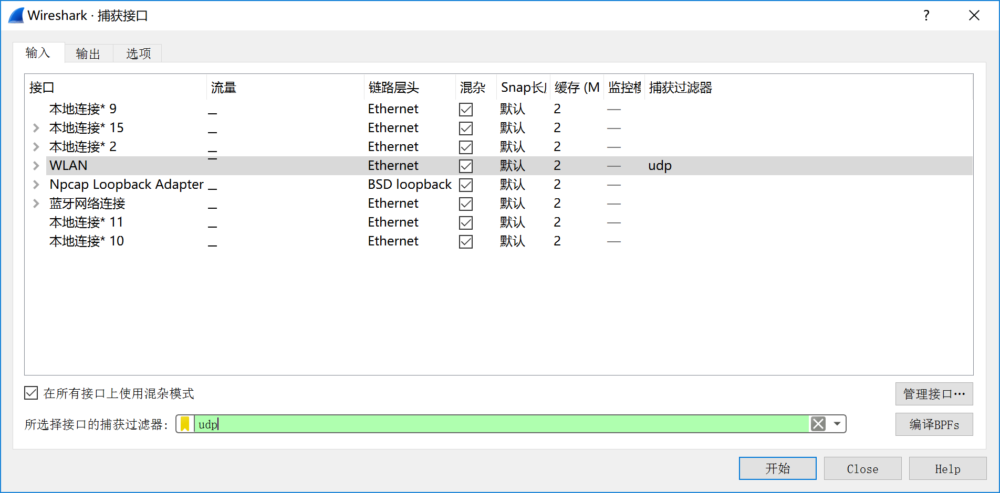
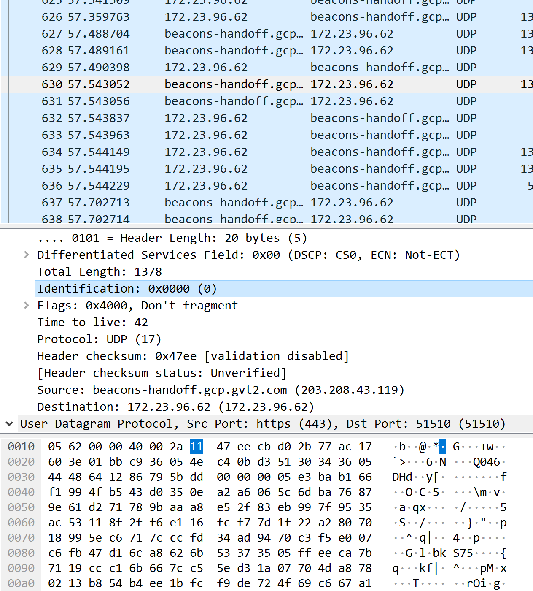
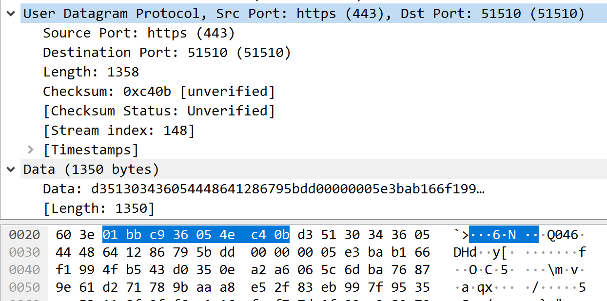
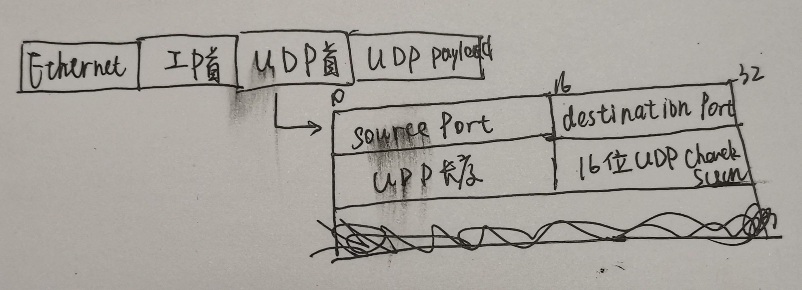
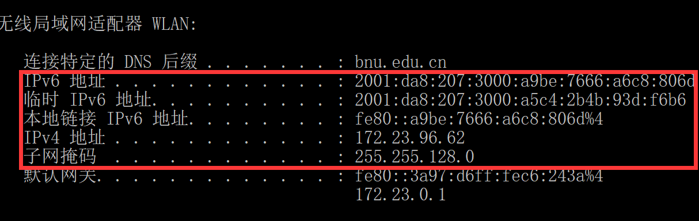
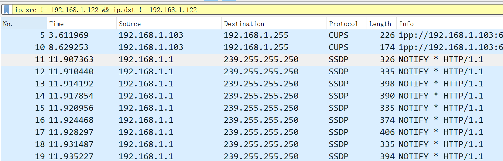

UDP 解书照 201611210137

> windows 64 bits BNU-Student 宿舍
>
> 数据：udp.pcapng, trace-udp.pcapng

## Step 1: Capture a Trace 

*Proceed as follows to capture a trace of UDP traffic; alternatively, you may use a supplied trace:*  

1. *Launch Wireshark and start a capture with a filter of “udp“.* 

   

2. *When the capture is started, perform some activities that will generate UDP traffic. We described several options above, e.g., browse the web or start a short VoIP call.* 

3. *Wait a little while (say 60 seconds) after you have stopped your activity to also observe any background UDP traffic. It is likely that you will observe a trickle of UDP traffic because system activity often uses UDP to communicate. We want to see some of this activity.* 

4. *Use the Wireshark menus or buttons to stop the capture. You should now have a trace with possibly many UDP packets. Our example is shown below.   We have selected a packet and expanded the detail of the UDP header.* 

   

## Step 2: Inspect the Trace

*Select different packets in the trace (in the top panel) and browse the expanded UDP header (in the middle panel).* 

## Step 3: UDP Message Structure

*To check your understanding of UDP, sketch a figure of the UDP message structure as you observed. It should show the position of the IP header, UDP header, and UDP payload. Within the UDP header, show the position and size of each UDP field you can observe using Wireshark. Your figure can simply show the message as a long, thin rectangle.* 

*By looking at the details of the UDP messages in your trace, answer these questions:* 

1. *What does the Length field include? The UDP payload, UDP payload and UDP header, or UDP payload, UDP header, and lower layer headers?*

   首部和数据总长度，单位为B

2. *How long in bits is the UDP checksum?* 

   33~48，16位

3. *How long in bytes is the entire UDP header?* 

   8B

## Step 4: UDP Usage

1. *Give the value of the IP Protocol field that identifies the upper layer protocol as UDP.*  

   17(十进制)

2. *Examine the UDP messages and give the destination IP addresses that are used when your computer is neither the source IP address nor the destination IP address. (If you have only your computer as the source or destination IP address then you may use the supplied trace.)* 

   我电脑的 IPv6 = 2001:da8:207:3000:a9be:7666:a6c8:806a

   IPv4 = 172.23.96.62

   

   我这里还真没有源ip和目的ip都不是172.23.96.62的数据包，所以我这里只能用题目提供的数据。

   题目给的trace-udp.pcapng的ip是192.168.1.122，可以看到有了

   

3. *What is the typical size of UDP messages in your trace?* 

   60~1000B

## 实验体会

加深了我对UDP协议的理解，了解了UDP首部的结构，丰富了我对计算机网络的认识，我学到了很多东西，增加了我对计网的兴趣。